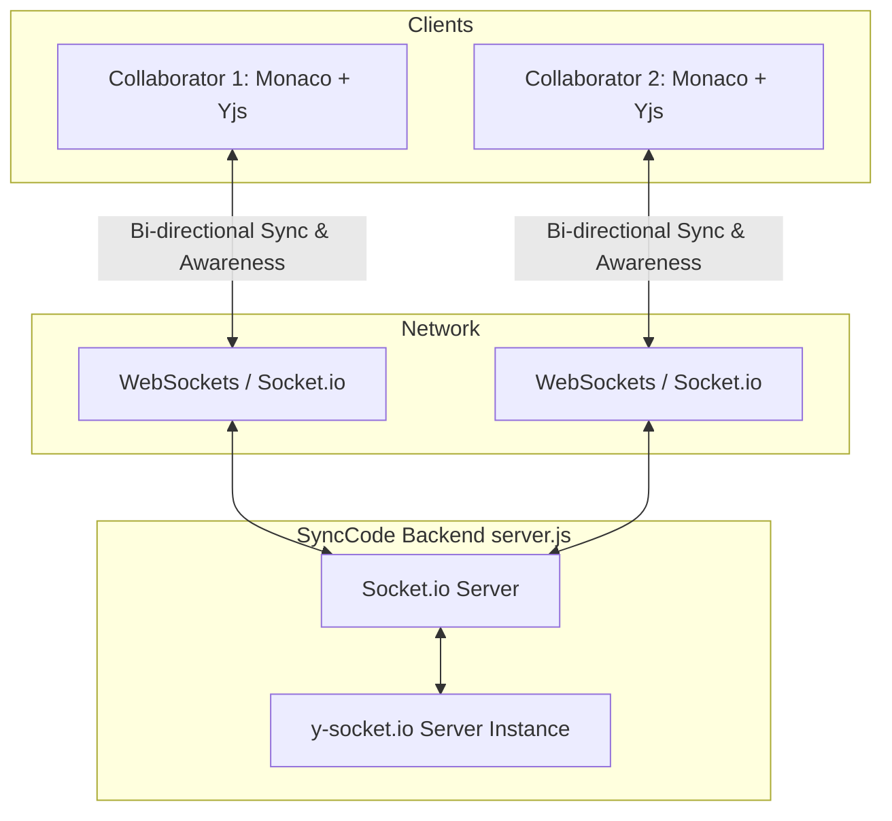

# ⚡ SyncCode
f
A state-of-the-art, high-performance, real-time collaborative developer workspace. SyncCode brings developers together by enabling low-latency, conflict-free code collaboration right in the browser. Powered by **Yjs (CRDTs)**, **Socket.io**, and the power of the industry-standard **Monaco Editor** (the engine behind VS Code), wrapped in a gorgeous futuristic dark glassmorphic interface built with **Tailwind CSS v4**.

---

## ✨ Features

- 👥 **Real-time Collaboration**: Seamless multi-user concurrent editing powered by **Yjs Conflict-Free Replicated Data Types (CRDTs)**, ensuring zero-conflict document merging.
- 🟢 **Presence & Awareness Tracking**: An interactive glassmorphic sidebar showcasing active collaborators, custom letter avatars, and visual connection statuses.
- 💻 **Monaco Editor Experience**: Harnesses VS Code's core editing capabilities, including rich syntax highlighting (defaulting to JavaScript), a code minimap, smooth cursor caret animations, code folding, and smooth scrolling.
- 🌌 **Sleek, Premium Design**: High-fidelity dark user interface styled with Tailwind CSS v4, containing glowing atmospheric neon backdrops, elegant borders, and micro-interactions.
- 🐳 **Multi-Stage Docker Support**: Ready-to-go Docker configuration compiling the frontend and packaging it inside a minimal, fast Node-Alpine backend container.

---

## 🛠️ Tech Stack

SyncCode leverages modern, industry-leading technologies:

| Layer | Technologies Used |
| :--- | :--- |
| **Frontend** | React 19, TypeScript, Vite, Monaco Editor (`@monaco-editor/react`), Tailwind CSS v4 |
| **Collaboration** | Yjs, `y-monaco` (binding Yjs to Monaco), `y-socket.io` (client-side provider) |
| **Backend & WS** | Node.js, Express, Socket.io, `y-socket.io` (server-side Yjs adapter) |
| **Containerization** | Multi-stage Docker, Node 20 Alpine |

---

## 📐 Architecture Flow



---

## 📂 Project Structure

The project is structured as a monorepo containing a frontend and a backend application:

```text
├── bd/                    # Backend application (Express + Socket.io Server)
│   ├── public/            # Static assets & compiled frontend (for production deployment)
│   ├── package.json       # Backend dependencies (express, socket.io, y-socket.io)
│   └── server.js          # Core server logic (WebSocket connection & Yjs server room setup)
│
├── fd/                    # Frontend application (React + Vite + TailwindCSS v4)
│   ├── src/
│   │   ├── App.tsx        # Main application component & Yjs/Monaco logic
│   │   ├── App.css        # Frontend styling
│   │   └── main.tsx       # Entry point
│   ├── vite.config.ts     # Vite configuration (includes Tailwind CSS plugin)
│   ├── package.json       # Frontend dependencies (React 19, Tailwind v4, yjs, y-monaco)
│   └── tsconfig.json      # TypeScript configuration
│
├── dockerfile             # Multi-stage build for production containerization
├── .dockerignore          # Prevents build artifacts & local node_modules copying
└── README.md              # Project documentation (this file)
```

---

## 🚀 Getting Started

### Prerequisites

Make sure you have the following installed on your machine:
- **Node.js** (v20 or higher recommended)
- **npm** (v10 or higher)
- **Docker** (Optional, for containerized deployments)

---

### 💻 Option 1: Local Development Setup (Manual)

To run the frontend and backend in developer mode with Hot Module Replacement (HMR):

#### 1. Start the Backend Server

Open a terminal window and navigate to the backend directory (`bd`):

```bash
cd bd
npm install
npm run dev
```

The backend server will spin up on [http://localhost:3000](http://localhost:3000) using `nodemon`.

#### 2. Start the Frontend Development Server

Open a second terminal window and navigate to the frontend directory (`fd`):

```bash
cd fd
npm install
npm run dev
```

Vite will run the frontend on [http://localhost:5173](http://localhost:5173). 

Open the link in your browser! To collaborate, open [http://localhost:5173](http://localhost:5173) in a second private browser window (or a different browser), sign in with a different username, and watch edits synchronize instantly between editors.

---

### 🐳 Option 2: Production Run using Docker

To build and run SyncCode in a completely containerized environment:

#### 1. Build the Docker Image

Run the following command in the root folder of the project (where the `dockerfile` resides):

```bash
docker build -t synccode:latest .
```

*This command runs a multi-stage build:*
- **Stage 1 (fd-builder):** Installs frontend dependencies and compiles the React app into optimized static production files (`fd/dist`).
- **Stage 2:** Installs backend dependencies and copies the compiled frontend assets from Stage 1 into the backend's `/public` directory.

#### 2. Run the Container

Start the compiled container by mapping the host port `3000` to the container's Express server port `3000`:

```bash
docker run -d -p 3000:3000 --name synccode-workspace synccode:latest
```

Now, navigate to **[http://localhost:3000](http://localhost:3000)** in your browser to access the complete application!

---

## 🧩 Key Architecture Details

- **Yjs CRDTs**: Instead of tracking line-by-line diffs, Yjs represents the document as a shared type (`Y.Text`). Changes are packaged as highly compact updates and synced via `y-socket.io` to the server, which rebroadcasts them.
- **Monaco Binding**: The `@monaco-editor/react` is synchronized using the `y-monaco` binding (`MonacoBinding`). The binding registers event listeners on Monaco's model and translates all user typing into collaborative Yjs update transactions.
- **Awareness Protocol**: User presence (connected collaborators list) is managed via the Yjs Awareness Protocol. When users connect, they broadcast a local state containing their name, which is populated inside the UI sidebar in real-time.

---

## 📝 License

This project is licensed under the **ISC License**. Feel free to customize and expand it!
